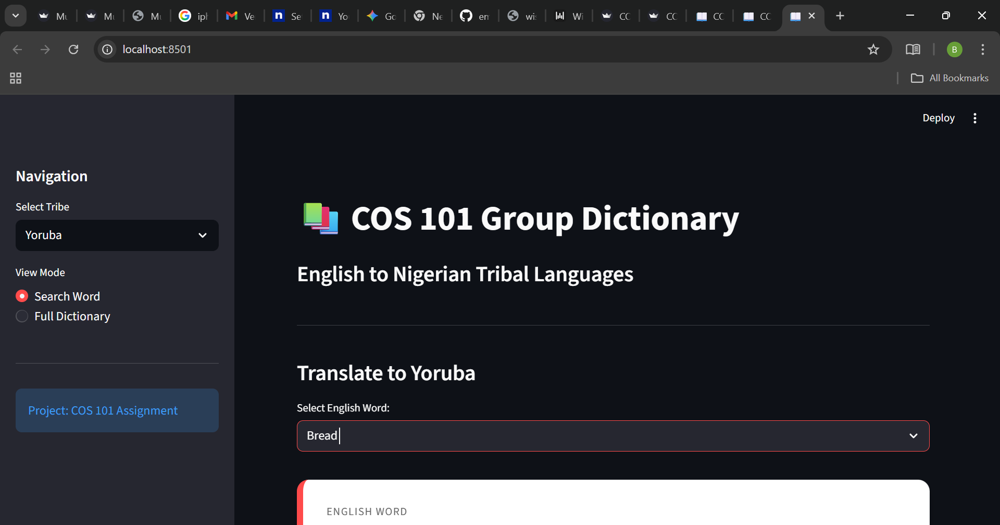
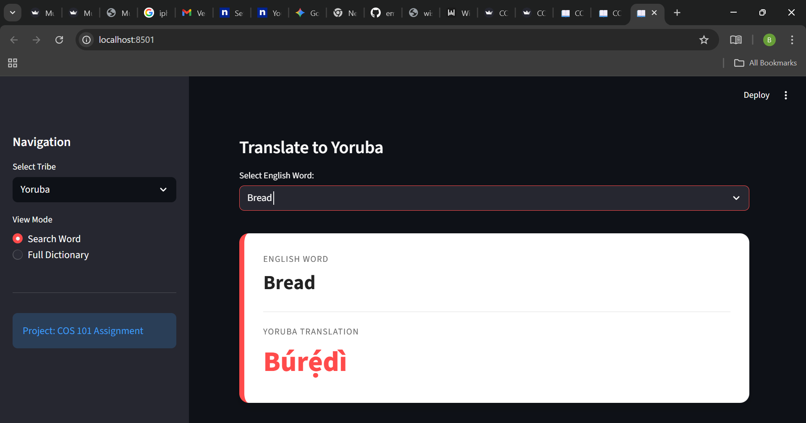

# COS 101 Group Dictionary
A Python-based web application built with Streamlit that translates English words into five Nigerian tribal languages: Yoruba, Hausa, Idoma, Khana, and Igala.

## Project Features
* **Multi-Tribe Support:** Select between 5 different languages.
* **Advanced Search:** Real-time English-to-Native translation.
* **Full Lexicon:** Access a database of 20 essential words for each tribe.

## Screenshots
### Main Interface

### Translation Example

## How to Run
1. Install Streamlit: `pip install streamlit`
2. Run the app: `streamlit run dictionary.py`